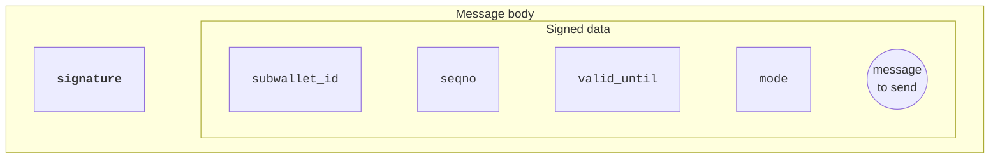
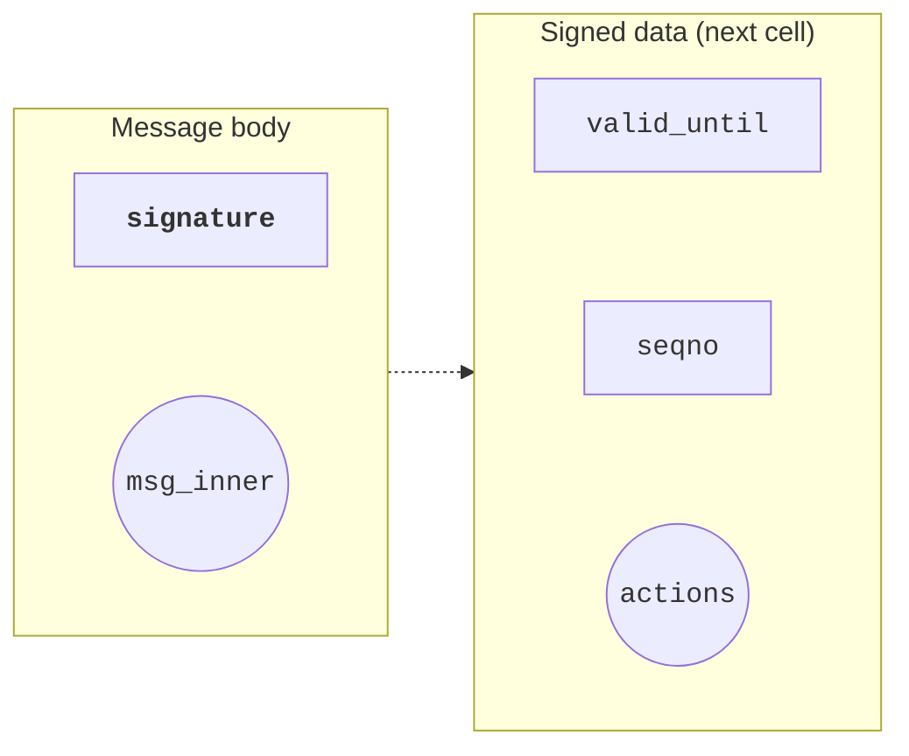

Cryptographic signatures are the foundation of access control. Contracts verify signatures on-chain and implement their own authorization policies for [wallet operations](/standard/wallets/how-it-works#how-ownership-verification-works), server-authorized actions, [gasless transactions](/standard/wallets/v5#gasless-transactions), multisig wallets, and delegation.

## Ed25519 in TON

TON uses [Ed25519](https://en.wikipedia.org/wiki/EdDSA#Ed25519) as the [standard](/foundations/whitepapers/tblkch#a-3-10-cryptographic-ed25519-signatures) signature scheme. All [wallets](/standard/wallets/history) (v1–v5) and [highload wallets](/standard/wallets/highload/overview) rely on Ed25519.

Specification:

- Public key size: 256 bits
- Signature size: 512 bits
- Curve: Ed25519

<Callout type="caution">
  The public key is _not_ the wallet address. The address is derived from the contract's initial code and data that are included in [`StateInit`](/foundations/messages/deploy) structure. Multiple contracts can use the same public key but have [different addresses](/foundations/addresses/overview).
</Callout>

## Other primitives

TVM exposes additional [cryptographic primitives beyond Ed25519](/tvm/instructions#cryptography). These are useful for cross-chain compatibility and advanced protocols:

| Primitive                                                                                     | Purpose                                                                       |
| --------------------------------------------------------------------------------------------- | ----------------------------------------------------------------------------- |
| [secp256k1](https://en.wikipedia.org/wiki/Secp256k1)                                          | Ethereum-style ECDSA via `ECRECOVER`; x-only pubkey operations (TVM v9+).     |
| [secp256r1 (P-256)](https://en.wikipedia.org/wiki/Elliptic_Curve_Digital_Signature_Algorithm) | ECDSA verification via `P256_CHKSIGNS` and `P256_CHKSIGNU`.                   |
| [BLS12-381](https://en.wikipedia.org/wiki/BLS_digital_signature)                              | Pairing-based operations for signature aggregation and zero-knowledge proofs. |
| [Ristretto255](https://en.wikipedia.org/wiki/Curve25519#Ristretto)                            | Prime-order group over Curve25519 for advanced cryptographic constructions.   |

This guide focuses on Ed25519, which is usually used for TON.

## Signing pipeline

Ed25519 signatures in TON typically operate on hashes rather than raw data. This ensures a fixed-size input regardless of message length.

- Off-chain (TypeScript)
  1. Serialize message data into a cell
  1. Compute its hash (256 bits)
  1. Sign the hash with private key
  1. Signature (512 bits)

- On-chain (Tolk)
  1. Contract receives signature and data
  1. Recomputes the hash
  1. Verifies signature matches the hash and public key

TVM provides two signature verification methods:

1. [`CHKSIGNU`](/tvm/instructions#f910-chksignu) checks signature of hash;
1. [`CHKSIGNS`](/tvm/instructions#f911-chksigns) checks signature of data.

Hash-based verification (`CHKSIGNU`) is preferred because `CHKSIGNS` only processes data from a single cell with a maximum size of 127 × 8 = 1016 bits and ignores [cell references](/foundations/serialization/cells). For messages containing multiple cells or references, hashing the entire structure first is required.

## Signature interaction patterns

Signatures are used in different ways depending on who signs the message, who sends it, and who pays for execution. Here are three real-world examples.

### Example 1: Standard wallets (v1–v5)

Standard wallet contracts are [described in more detail](/standard/wallets/history) in the wallets section.

How it works:

1. User signs a message off-chain that includes replay protection data and transfer details.
1. User sends external message to blockchain.
1. Wallet contract verifies the signature.
1. Wallet contract checks seqno for replay protection.
1. Wallet contract accepts the message and pays gas from the wallet balance.
1. Wallet contract increments seqno.
1. Wallet contract executes the transfer.

Key characteristics:

- Who signs: user
- Who sends: user (external message)
- Who pays gas: wallet contract

This is the most common pattern.

### Example 2: Gasless transactions (wallet v5)

How it works:

1. User signs a message off-chain that includes two transfers: one to recipient, one to service as payment.
1. User sends signed message to service using API.
1. Service verifies the signature.
1. Service wraps signed message in internal message.
1. Service sends internal message to user's wallet and pays gas in TON.
1. Wallet contract verifies user's signature.
1. Wallet contract checks seqno for replay protection.
1. Wallet contract increments seqno.
1. Wallet contract executes both transfers to the recipient and to the service.

Key characteristics:

- Who signs: user
- Who sends: service (internal message)
- Who pays gas: service (in TON), gets compensated in jettons

This pattern enables users to pay gas in jettons instead of TON.

### Example 3: Server-controlled operations

How it works:

1. User requests authorization from server.
1. Server validates request and signs authorization message that includes validity period and operation parameters.
1. User sends server-signed message to contract with payment.
1. Contract verifies server's signature.
1. Contract checks validity period.
1. Contract performs authorized action, including deploy, mint, and claim.
1. If the user tries to send the same message again, the contract ignores it because the state has already changed.

Key characteristics:

- Who signs: server
- Who sends: user (internal message with payment)
- Who pays gas: user

This pattern is useful when the backend needs to authorize specific operations, such as auctions, mints, and claims, without managing private keys for each user.

Real-world example: the [telemint contract](https://github.com/TelegramMessenger/telemint) uses server-signed messages to authorize NFT deployments.

## Message structure for signing

When designing a signed message, decide how to organize the data to be signed — the message fields that are hashed and verified. The data can be represented as a **slice** or as a **cell**. This choice affects gas consumption during signature verification.

### Approach 1: Signed data as slice

After loading the signature from the message body, the signed data remains as a slice — part of the cell that may contain additional data and references. This approach is used in wallets v1–v5.

Schema for the wallet v3r2:

```tlb title="TL-B"
msg_body$_ signature:bits512
  subwallet_id:uint32
  seqno:uint32
  valid_until:uint32
  mode:uint8
  message_to_send:^Cell
  = ExternalInMessage;
```



Verification:

```tolk title="Tolk"
var inMsgBody = in.body;
val signature = inMsgBody.loadBits(512);
val signedData = inMsgBody;   // remaining data

val hash = signedData.hash();
assert (isSignatureValid(hash, signature, publicKey)) throw 35;
```

Gas analysis:

After loading the signature, the remaining data is a **slice**. To verify the signature, the contract needs to hash this slice. In TVM, the method for hashing a slice is `slice.hash()`, which costs 526 gas.

This cost is high because `slice.hash()` internally rebuilds a cell from the slice, copying all data and references.

<Callout
  type="tip"
  title="Optimization available"
>
  TVM v12 and later versions support `builder.hash()` for efficient hashing. [Convert the slice to a builder and hash it](#optimization-builder-hashing) — this costs less than 100 gas total.
</Callout>

### Approach 2: Signed data as cell

The signed data is stored in a **separate cell**, placed as a reference in the message body. This approach is used in preprocessed wallet v2 and highload wallet v3.

Schema for the preprocessed wallet v2:

```tlb title="TL-B"
_ valid_until:uint64 seqno:uint16 actions:^Cell = MsgInner;

msg_body$_ signature:bits512 msg_inner:^MsgInner = ExternalInMessage;
```



Verification:

```tolk title="Tolk"
var inMsgBody = in.body;
val signature = inMsgBody.loadBits(512);
val signedData = inMsgBody.loadRef(); // Signed data as cell

val hash = signedData.hash();
assert (isSignatureValid(hash, signature, publicKey)) throw 35;
```

Gas analysis:

The signed data is loaded as a **cell** from the reference. To get its hash, the contract uses `cell.hash()`, which costs 26 gas.

This is efficient because every cell in TON stores its hash as metadata. `cell.hash()` reads this precomputed value directly without rebuilding or copying the data.

This approach adds one extra cell to the message, increasing the forward fee. However, the gas savings of \~500 gas outweigh the increase in forward fees.

### Optimization: Builder hashing

Starting with TVM v12, builder hashing is available through the `HASHBU` instruction. This optimization reduces the gas cost of the "signed data as slice" approach.

Verification (optimized):

```tolk title="Tolk"
var inMsgBody = in.body;
val signature = inMsgBody.loadBits(512);
val signedData = inMsgBody;

val b = beginCell().storeSlice(signedData);
val hash = b.hash();
assert (isSignatureValid(hash, signature, publicKey)) throw 35;
```

Gas comparison:

| Method                  | Gas cost  | Notes                                |
| ----------------------- | --------- | ------------------------------------ |
| `slice.hash()`          | 526 gas   | Rebuilds cell from slice             |
| Builder hashing (slice) | \<100 gas | With `HASHBU`: cheap builder hashing |
| `cell.hash()` (cell)    | 26 gas    | Uses precomputed cell hash           |

With builder hashing, both approaches are gas-efficient. Choose based on code simplicity and forward fee considerations.

Reference: [`GlobalVersions.md` — TVM improvements](https://github.com/ton-blockchain/ton/blob/5c0349110bb03dd3a241689f2ab334ae1a554ffb/doc/GlobalVersions.md#new-tvm-instructions-4)

## Sign messages in TypeScript

### Prerequisites

- [Node.js](https://nodejs.org/en/download/) 18 or later LTS
- `@ton/core` and `@ton/crypto` installed:
  ```bash
  npm install @ton/core @ton/crypto
  ```

### Step 1: Generate or load a mnemonic \[step]

A mnemonic is the wallet's master secret. It derives the private key used to sign messages.

Generate a new mnemonic:

```ts title="TypeScript"
import { mnemonicNew } from '@ton/crypto';

const mnemonic = await mnemonicNew(24); // Array of 24 words
```

Load an existing mnemonic:

```ts title="TypeScript"
// Read from environment; do not inline secrets
const mnemonic = (process.env.MNEMONIC ?? 'MNEMONIC_WORDS').split(' ');
```

<Callout
  type="danger"
  title="Protect the mnemonic"
>
  Anyone with access to the mnemonic can control the wallet and all its funds. Store it securely using a password manager, a hardware wallet, or encrypted storage. Never commit it to version control.
</Callout>

### Step 2: Derive the keypair \[step]

Convert the mnemonic to an Ed25519 keypair:

```ts title="TypeScript"
import { mnemonicToPrivateKey } from '@ton/crypto';

const keyPair = await mnemonicToPrivateKey(mnemonic);
// keyPair.publicKey  — stored in contract
// keyPair.secretKey  — used to sign messages
```

### Step 3: Build the signed data \[step]

Build the message data that will be signed:

```ts title="TypeScript"
import { beginCell } from '@ton/core';

// Build signed data (example: wallet message)
const seqno = 5;
const validUntil = Math.floor(Date.now() / 1000) + 60; // 60 seconds from now

const signedData = beginCell()
    .storeUint(seqno, 32)
    .storeUint(validUntil, 32)
    // ... other fields (subwallet_id, actions, etc.)
    .endCell();
```

### Step 4: Create the signature \[step]

Sign the hash of the signed data:

```ts title="TypeScript"
import { sign } from '@ton/crypto';

const signature = sign(signedData.hash(), keyPair.secretKey);
// signature is a Buffer with 512 bits
```

### Step 5: Build the message body \[step]

Choose the structure based on the contract design:

```ts title="TypeScript"
// Approach 1: Signed data as slice
const messageBodyInline = beginCell()
    .storeBuffer(signature)             // 512 bits
    .storeSlice(signedData.asSlice())   // Signed data as slice
    .endCell();

// Approach 2: Signed data as cell
const messageBodySeparate = beginCell()
    .storeBuffer(signature)             // 512 bits
    .storeRef(signedData)               // Signed data as cell
    .endCell();
```
