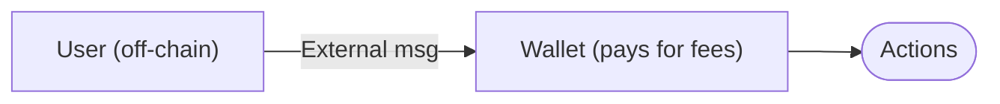
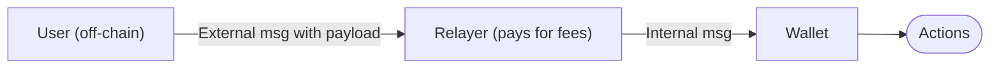

import { Aside } from '/snippets/aside.jsx';

Gasless transactions execute wallet operations when the wallet owner does not hold Toncoin to pay [network fees](/foundations/fees). A relayer service and its on-chain contract submit transactions on behalf of users and attach Toncoin to cover gas costs.

<Aside type="note">
  The wallet contract must support owner-signed internal messages — implementations that only accept external messages cannot participate in gasless flows.
</Aside>

## How it works

### Core mechanism

On TON, every smart contract processes two message types:

- External messages: arrive from outside the blockchain. When a wallet contract receives an external message, it pays gas from its own Toncoin balance.
- Internal messages: arrive from other contracts. Gas is paid from Toncoin attached to the message.

Gasless transactions use internal messages: the relayer's contract sends an internal message with attached Toncoin to the wallet contract. The wallet executes actions without spending its own balance.

### Architecture

Regular transfers:

Gasless transfers:

Three components enable gasless transactions:

1. Wallet contract with authenticated internal message support
1. Relayer service that validates and submits transactions
1. Signature scheme that proves user authorization

### Transaction flow

#### Step 1: User creates signed payload

The user's wallet application:

- Constructs an action list (transfers, contract calls)
- Adds replay protection (sequence number, expiration timestamp)
- Signs with the wallet's private key
- Sends signed payload to relayer via an API

#### Step 2: Relayer validates

The relayer verifies off-chain:

- Signature is authentic (confirmed with the wallet's public key)
- Sequence number matches the current wallet state
- Expiration timestamp is valid
- Payment terms are met (if applicable)

#### Step 3: Relayer submits internal message

The relayer's contract sends an internal message to the user's wallet:

- Attaches sufficient Toncoin for gas
- Includes the user's signed payload as the message body
- Spends the relayer's Toncoin, not the user's

#### Step 4: Wallet executes

The wallet contract:

- Verifies signature on-chain
- Checks replay protection
- Executes signed actions using attached Toncoin
- Increments sequence number

The blockchain sees a standard internal message. Authentication happens inside the wallet contract.

## Payment models

Relayers use different models to recover gas costs:

- Jetton payment: the user includes a jetton transfer to the relayer in the signed action list. The relayer receives jettons after transaction execution.
- Prepaid credits: the user purchases credits off-chain. The relayer deducts credits per transaction. No on-chain payment.
- Sponsorship: the relayer covers costs without payment. Common for onboarding, promotions, or subsidized dApp actions. Requires abuse prevention (rate limits, address restrictions).

## Security

### Cryptographic protection

The user's signature covers all actions and replay protection data. The wallet contract verifies the signature on-chain before execution.

Guarantees:

- Relayer cannot modify actions, recipients, or amounts
- Relayer cannot forge transactions
- Relayer cannot replay old transactions (sequence numbers prevent this)
- Relayer cannot use expired signatures (expiration timestamps prevent this)

Any modification invalidates the signature and causes rejection.

### Relayer trust requirements

The relayer controls transaction submission but cannot compromise funds:

The relayer can:

- Refuse to submit transactions (censorship)
- Delay submission (timing attacks)
- Observe transaction content before submission (privacy loss)

The relayer cannot:

- Modify signed actions
- Steal funds
- Create unauthorized transactions

Users depend on relayer availability and honesty for submission, but funds remain cryptographically protected.

### MEV and front-running

The relayer sees transaction content before blockchain submission, which enables value extraction:

- Sandwich attacks: for DEX trades, the relayer can submit its own transactions before and after the user's transaction to profit from price impact.
- Transaction reordering: the relayer can delay or reorder transactions to maximize profit, particularly in DeFi scenarios where order matters.

Mitigation:

- Use short expiration windows (60-300 seconds)
- Choose relayers with reputation systems
- For high-value operations, use direct external messages when Toncoin is available
- Monitor for suspicious delays or failures

### Operational risks

- Insufficient gas: if the relayer attaches too little Toncoin, execution fails. The wallet's sequence number does not increment, so the user can retry with the same signed payload.
- Network congestion: gas costs spike during high load. Relayers may refuse service or increase fees temporarily.
- Jetton payment risks: jetton contracts may have restrictions, insufficient balance, or bugs. Relayers should emulate transactions off-chain before spending Toncoin.
- Prepaid credit risks: users trust the relayer to honor off-chain credit balances. No on-chain recourse if the relayer refuses service.
- Sponsorship abuse: without rate limits and address restrictions, attackers can drain relayer resources through spam.

### Relayer compromise

If a relayer's infrastructure is breached:

The attacker gains:

- Visibility into pending transactions
- User IP addresses and metadata
- Ability to censor transactions

The attacker does not gain:

- Ability to forge signatures
- Ability to steal funds
- Ability to modify signed actions

Users can switch to alternative relayers or use external messages once Toncoin is available.

## Example: jetton payment

Alice wants to send 100 USDT to Bob but has zero Toncoin. The relayer charges 0.5 USDT.

Alice's wallet:

1. Creates actions: send 100 USDT to Bob, send 0.5 USDT to the relayer
1. Adds a sequence number (e.g., 42) and expiration (e.g., 5 minutes)
1. Signs with the private key
1. Sends signed payload to relayer API

Relayer:

1. Verifies signature against Alice's public key
1. Checks that the sequence number is 42 (matches wallet state)
1. Checks that the expiration is valid
1. Sends internal message to Alice's wallet with 0.1 Toncoin attached

Alice's wallet contract:

1. Receives the internal message
1. Verifies signature
1. Checks that the sequence number is 42 and the expiration is valid
1. Executes both USDT transfers using attached 0.1 Toncoin for gas
1. Increments sequence number to 43

Result:

- Alice: 0 Toncoin (unchanged), -100.5 USDT
- Bob: +100 USDT
- Relayer: -0.1 Toncoin, +0.5 USDT

The relayer accumulates USDT fees and exchanges them for Toncoin periodically.

## Limitations

Not a protocol feature: gasless transactions are an application-layer pattern. The blockchain does not enforce or guarantee relayer behavior.

Wallet requirement: the wallet contract must support authenticated internal messages. Not all wallet implementations provide this. In practice, only Wallet v5 reference contracts currently implement owner-signed internal messages.

No standardization: relayer APIs, fee structures, and supported assets vary. Each integration requires custom implementation.

[TON Connect](/ecosystem/ton-connect/overview) incompatibility: currently, TON Connect does not support gasless. The `sendTransaction` method does not return signed payloads to dApps — it submits transactions directly. Gasless requires obtaining signed payloads and forwarding them to relayers off-chain.

<Aside type="note">
  dApps that need gasless must implement custom signing flows outside TON Connect. Users sign payloads directly via a browser extension or a native app and send them to relayers via an API.
</Aside>

Centralization: users depend on relayer uptime, policies, and willingness to serve requests. Relayers can censor addresses or refuse service.

## Implementation

### Wallet contract requirements

- Accept authenticated internal messages signed by the wallet owner
- Enforce replay protection (sequence numbers, expiration timestamps) for both external and internal messages
- Use distinct operation codes for external and internal entry points to prevent cross-channel replay attacks

### Relayer requirements

- Validate signatures and replay protection off-chain before spending Toncoin
- Attach sufficient Toncoin to cover gas for wallet execution and outgoing actions
- Implement rate limiting and abuse prevention
- For jetton payments, emulate transactions to verify successful execution
- Forward the signed payload verbatim in the internal message body without modifying fields covered by the signature

### Example: wallet v5

The [wallet v5](/standard/wallets/v5) standard supports gasless via the `internal_signed` message format:

- Separate opcodes for external and internal messages prevent replay attacks
- The contract enforces signature verification, sequence numbers, and expiration checks for owner-signed internal messages
- A relayer forwards the signed payload verbatim as the internal message body and attaches Toncoin for gas
