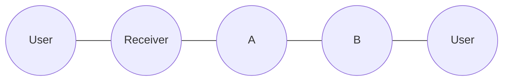
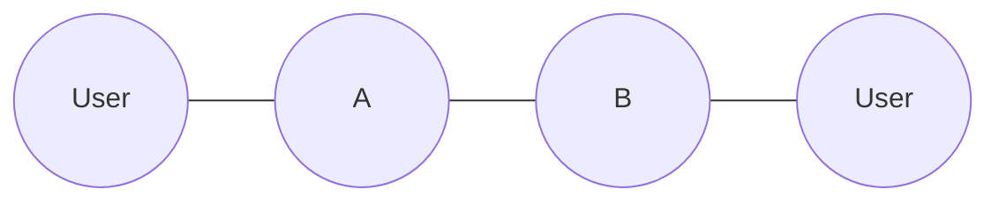
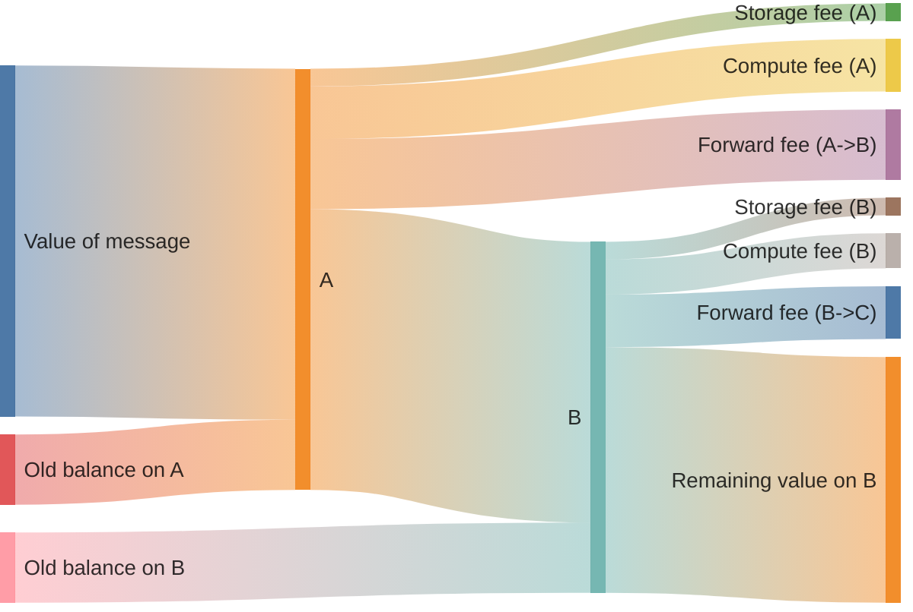

import { Aside } from "/snippets/aside.jsx";

Contracts that receive the initial external message are referred to as **receiver** contracts. Other contracts in the same system are called **internal** contracts. This terminology is local to this article.

## Contract system

Consider a contract system with three contracts:

1. receiver;
1. internal contract A;
1. internal contract B.

### Transaction trace

In that system, the typical trace looks like this, with transactions moving from left to right.



### Value flow

<Aside type="tip">
  The following explanation uses an abstract contract system and is not connected to any existing project. It is primarily applicable to systems that follow a carry-value pattern, where value is passed between contracts as part of message processing.
</Aside>

There is _no separate_ message balance and contract balance. After the message is received, coins from the message are stored to the contract balance, and then the contract is executed. [Sending message modes](/foundations/messages/modes) and [reserve actions](/foundations/actions/reserve) help to properly divide contract balance in the action phase. This diagram of a possible value flow illustrates this.





### Receiver requirements

Receiver contracts must verify that the attached Toncoin is sufficient to cover fees for all contracts in the subsequent trace. If an entry contract accepts an external message, it must guarantee that the message will not later fail due to insufficient attached Toncoin. "Accept" doesn't mean the call to `accept_message()`, but semantic acceptance, i.e., no throw and no asset returns.

The reason for this requirement is that reverting the contract system state is usually not possible, because the Toncoin is already spent.

When a contract system's correctness depends on successful execution of the remaining transaction trace, it must guarantee that an incoming message carries enough attached Toncoin to cover all fees. This article describes how to compute those fees.

## Define fee limits

- Define variables for limits and initialize them to zero. Set them to actual values afterwards.
- Use descriptive names for the operation and the contract. Store them in a dedicated file with constants.

```tolk
const GasSwapRequest: int = 0;
```

- Run tests covering all execution paths. Missing a path might hide the most expensive one.
- Extract resource consumption from the `send()` method's return value. The sections below describe ways to compute consumption of different kinds of resources.
- Use `expect(extractedValue).toBeLessThanOrEqual(hardcodedConstant)` to verify that the hardcoded limit was not exceeded.

```ts
import {findTransactionRequired} from "@ton/test-utils";

const result = await contract.send(/* params */);
const vaultTx = findTransactionRequired(result.transactions, {
    on: contract.address,
    op: 0x12345678,
});
expect(
    getComputeGasForTx(vaultTx),
).toBeLessThanOrEqual(GasSwapRequest);
```

After the first run, use the displayed error message to find the actual value for the constant.

```text
expect(received).toBeLessThanOrEqual(expected)

Expected: <= 0n
Received:    11578n
```

```tolk
const GasSwapRequest: int = 12000;
```

## Compute fees

There are two kinds of values: gas units and Toncoin. The price of contract execution is fixed in gas units. However, the price of the gas itself is determined by the [blockchain configuration](/foundations/config).

Convert gas to Toncoin on-chain using blockchain configuration:

```tolk
import "@stdlib/gas-payments";

val workchain = contract.getAddress().getWorkchain();
val fee = calculateGasFee(workchain, hardcodedGasValue);
```

This function uses the [`GETGASFEE`](/tvm/instructions#f836-getgasfee) TVM opcode.

## Forward fees

Forward fee is calculated with this formula:

```
fwdFee = lumpPrice
       + priceForCells * (msgSizeInCells - 1)
       + priceForBits * (msgSizeInBits - bitsInRoot)
```

where

- `lumpPrice` is the fixed value [from config](/foundations/config#param-24-and-25%3A-message-price) paid once for the message.
- `msgSizeInCells` is the number of cells in the message.
- `msgSizeInBits` is the number of bits in all the cells of the message.

In Tolk, `cell.calculateSizeStrict()` can be used to compute `msgSizeInCells` and `msgSizeInBits`. In TVM, it's implemented as [`CDATASIZE`](/tvm/instructions#f941-cdatasize) instruction.

In Tolk, the formula above is implemented in `calculateForwardFee()`. In TVM, it's implemented as [`GETFORWARDFEE`](/tvm/instructions#f838-getforwardfee) instruction.

```tolk
import "@stdlib/gas-payments";

val workchain = contract.getAddress().getWorkchain();
val msgCell = msg.toCell();
val (cells, bits, _) = msgCell.calculateSizeStrict(8192);

val fwdFee = calculateForwardFee(
    workchain,
    bits - msgCell.beginParse().remainingBitsCount(),
    cells - 1,
);
```

<Aside
  type="caution"
>
  The `calculateSizeStrict(maxCells)` call consumes a large, potentially unpredictable amount of gas. If it is possible to precompute the message size, it is recommended to do so.

  The `maxCells` argument limits the number of cells to visit. Usually it is set to 8192 since it is the [limit for message size](/foundations/limits#message-and-transaction-limits). It can be used to cap the amount of gas spent on size calculation.
</Aside>

If intermediate `(cells, bits)` values are not required, `msg.send()` with mode 1024 can be used instead, allowing TVM to perform the same calculations as `calculateForwardFee()`. In TVM, this is implemented as [`SENDRAWMSG`](/tvm/instructions#fb00-sendrawmsg) and consumes approximately the same amount of gas.

### Optimized forward fee calculation

If the size of the incoming message bounds the size of the outgoing message, the forward fee of the outgoing message can be estimated as no larger than the forward fee of the incoming message, which TVM already computes. In this case, the forward fee does not need to be calculated again. This estimation is valid only for contract systems within the same workchain, because gas prices depend on the workchain.

```tolk title="Tolk"
fun onInternalMessage(in: InMessage) {
    val fwdFee = in.originalForwardFee;
    // ...
}
```

### Complex forward fee calculation

Assume the contract receives a message with an unknown size and forwards it further adding fields with total of `a` bits and `b` cells to the message, e.g., [`StateInit`](/foundations/messages/deploy).

For this case, in Tolk, there is a function `calculateForwardFeeWithoutLumpPrice()`. In TVM, it's implemented as [`GETFORWARDFEESIMPLE`](/tvm/instructions#f83c-getforwardfeesimple). This function does not take `lumpPrice` into account.

```tolk title="Tolk"
import "@stdlib/gas-payments";

fun onInternalMessage(in: InMessage) {
    val workchain = contract.getAddress().getWorkchain();
    val origFwdFee = in.originalForwardFee;

    // "Out" message will consist of fields from
    // "in" message, and some extra fields.
    // Forward fee for "out" message is estimated
    // from a forward fee for "in" message
    val additionalFwdFee = calculateForwardFeeWithoutLumpPrice(
        workchain,
        additionalFieldsSize.bits,
        additionalFieldsSize.cells,
    );
    val totalFwdFee = origFwdFee + additionalFwdFee;

    // Remember to multiply totalFwdFee by the number
    // of hops in the trace
}
```

## Storage fees

<Aside>
  For calculating storage fees, the maximum possible contract size in `cells` and `bits` should be known. Calculating it manually might be hard if the contract stores a hashmap or another complex data structure in its state.

  It might be easier to compute it by writing a test that occupies the maximum possible size, and use the measured value. There are [helper functions](#helper-functions) for doing these measurements.
</Aside>

Storage fees for sending messages cannot be predicted in advance, because they depend on how long the target contract has not paid storage fees. In this respect, storage fees differ from forward and compute fees, as they must be handled in both receiver and internal contracts.

### Maintain a positive reserve

Always keep a minimum balance on all contracts in the system. Storage fees get deducted from this reserve. The reserve gets replenished with each external interaction. Do not hardcode Toncoin values for fees. Instead, hardcode the maximum possible contract size in cells and bits.

This approach affects code of internal contracts.

<Aside type="tip">
  It is the developer's decision for how long the storage fees should be reserved. Popular options are 5 and 10 years.
</Aside>

```tolk
import "@stdlib/gas-payments";

const secondsInFiveYears = 5 * 365 * 24 * 60 * 60;

fun onInternalMessage(in: InMessage) {
    val workchain = contract.getAddress().getWorkchain();
    val minTonsForStorage = calculateStorageFee(
        workchain,
        secondsInFiveYears,
        maxBits,
        maxCells,
    );
    val oldBalance = contract.getOriginalBalance() - in.valueCoins;
    reserveToncoinsOnBalance(
        max(oldBalance, minTonsForStorage),
        RESERVE_MODE_AT_MOST,
    );
    // Process operation with remaining value...
}
// This contract probably also requires code allowing the owner to withdraw Toncoin from it.
```

In this approach, a receiver contract should calculate maximum possible storage fees for all contracts in trace.

```tolk
import "@stdlib/gas-payments";

const secondsInFiveYears = 5 * 365 * 24 * 60 * 60;

fun onInternalMessage(in: InMessage) {
    val workchain = contract.getAddress().getWorkchain();
    // Suppose the trace is:
    // receiver -> A -> B
    val storageForA = calculateStorageFee(
        workchain,
        secondsInFiveYears,
        maxBitsInA,
        maxCellsInA,
    );
    val storageForB = calculateStorageFee(
        workchain,
        secondsInFiveYears,
        maxBitsInB,
        maxCellsInB,
    );
    val totalStorageFees = storageForA + storageForB;
    // Compute + forward fees go here.
    val otherFees = 0;
    // `ERR_NOT_ENOUGH_TON` means "not enough Toncoin attached".
    assert (in.valueCoins >= totalStorageFees + otherFees)
        throw ERR_NOT_ENOUGH_TON;
}
```

<Aside
  type="caution"
>
  Verify the hardcoded contract size in tests.
</Aside>

### Cover storage on demand

The order of phases [depends](/foundations/phases) on the `bounce` flag of an incoming message. If all messages in the protocol are unbounceable, then the storage phase comes after the credit phase. So, the contract's storage fees are deducted from the joint balance of the contract and incoming message. In this case the pattern where the contract's balance is zero and incoming messages cover storage fees can be applied.

It is impossible to know in advance what the storage fee due will be on the contract, so a threshold must be selected depending on the network configuration. It is a good practice to use [`freeze_due_limit`](/foundations/config#param-20-and-21%3A-gas-prices) as the threshold. Otherwise, the contract likely is already frozen and a transaction chain is likely to fail anyway.

This pattern can be generalized to both bounceable and unbounceable messages with `contract.getStorageDuePayment()`, which returns [`storage_fees_due`](/foundations/phases#storage-phase).

This approach affects code of internal contracts.

```tolk
import "@stdlib/gas-payments";

fun onInternalMessage(in: InMessage) {
    // Reserve the original balance plus any storage debt
    reserveToncoinsOnBalance(
        contract.getStorageDuePayment(),
        RESERVE_MODE_INCREASE_BY_ORIGINAL_BALANCE | RESERVE_MODE_EXACT_AMOUNT,
    );

    // Send remaining value onward
    val forwardMsg = createMessage({
        bounce: BounceMode.NoBounce,
        dest: nextHop,
        value: 0,
        // ...
    });
    forwardMsg.send(SEND_MODE_CARRY_ALL_BALANCE);
}
```

If the remaining trace involves `n` unique contracts, no more than `n` freeze limits are required to cover their storage fees. Therefore, the receiver contract should perform the following check:

<Aside type="caution">
  `FreezeDueLimit` is network-specific. The value below uses the current mainnet `freeze_due_limit`; verify the target network configuration before reusing it.
</Aside>

```tolk
const FreezeDueLimit: coins = ton("0.1");  // Current mainnet freeze_due_limit.

fun onInternalMessage(in: InMessage) {
    // The trace is still receiver -> A -> B
    val freezeLimit = FreezeDueLimit;
    val otherFees = 0;  // Compute + forward fees go here.
    // n equals 3 because receiver -> A -> B
    // `ERR_NOT_ENOUGH_TON` means "not enough Toncoin attached".
    assert (in.valueCoins >= freezeLimit * 3 + otherFees)
        throw ERR_NOT_ENOUGH_TON;
}
```

For contracts using this approach, confirm there is no excess accumulation:

```typescript
it("should not accumulate excess balance", async () => {
    await pool.sendSwap(amount);
    const contract = await blockchain.getContract(
        pool.address,
    );
    const balance = contract.balance;
    expect(balance).toEqual(0n);
});
```

This confirms that all incoming value was consumed or forwarded, with none left behind. It helps identify any bugs that cause accumulation of Toncoin on any contract.

## Implement fee validation

The final code in the receiver contract could look like this:

```tolk
import "@stdlib/gas-payments";

const FreezeDueLimit: coins = ton("0.1");  // Current mainnet freeze_due_limit.

fun onInternalMessage(in: InMessage) {
    val workchain = contract.getAddress().getWorkchain();
    val msg = lazy SwapRequest.fromSlice(in.body);
    val fwdFee = in.originalForwardFee;

    // Count all messages in the operation chain.
    // IMPORTANT: we know that each of these messages is
    // less than or equal to `SwapRequest`.
    val messageCount = 3;  // receiver -> vault -> pool -> vault

    // Calculate the minimum required value
    val minFees =
        messageCount * fwdFee +
        // Operation in the first vault
        calculateGasFee(workchain, GasSwapRequest) +
        // Operation in the pool
        calculateGasFee(workchain, GasPoolSwap) +
        // Operation in the second vault
        calculateGasFee(workchain, GasVaultPayout) +
        3 * FreezeDueLimit;

    // `ERR_INSUFFICIENT_TON_ATTACHED` means "insufficient Toncoin attached".
    assert (in.valueCoins >= msg.amount + minFees)
        throw ERR_INSUFFICIENT_TON_ATTACHED;

    // Send remaining value for fees...

    // It may also be necessary to handle fees on this exact
    // contract if it is not supposed to hold incoming Toncoin.
    // That can be done using either of the two approaches
    // described above.
}
```

## Helper functions

Getting gas for the transaction in sandbox is:

```ts
function getComputeGasForTx(tx: Transaction): bigint {
    if (tx.description.type !== "generic") {
        throw new Error("Expected generic transaction");
    }
    if (tx.description.computePhase.type !== "vm") {
        throw new Error("Expected VM compute phase");
    }
    return tx.description.computePhase.gasUsed;
}
```

To calculate the size of a message in cells, use this function:

```ts
const calculateCellsAndBits = (
    root: Cell,
    visited: Set<string> = new Set<string>()
) => {
    const hash = root.hash().toString("hex");
    if (visited.has(hash)) {
        return { cells: 0, bits: 0 };
    }
    visited.add(hash)
    let cells = 1;
    let bits = root.bits.length;
    for (const ref of root.refs) {
        const childRes = calculateCellsAndBits(
            ref,
            visited,
        );
        cells += childRes.cells;
        bits += childRes.bits;
    }
    return { cells, bits, visited };
};
```

To extract a contract's size in tests, use this function:

```ts
export async function getStateSizeForAccount(
    blockchain: Blockchain,
    address: Address,
): Promise<{cells: number; bits: number}> {
    const contract = await blockchain.getContract(address);
    const accountState = contract.accountState;
    if (!accountState || accountState.type !== "active") {
        throw new Error("Account state not found");
    }
    if (!accountState.state.code || !accountState.state.data) {
        throw new Error("Account state code or data not found");
    }
    const accountCode = accountState.state.code;
    const accountData = accountState.state.data;
    const codeSize = calculateCellsAndBits(
        accountCode,
    );
    const dataSize = calculateCellsAndBits(
        accountData,
        codeSize.visited,
    );
    return {
        cells: codeSize.cells + dataSize.cells,
        bits: codeSize.bits + dataSize.bits,
    };
};
```

Message-size constants should be verified across all possible paths in tests. Otherwise, the resulting gas estimates might be wrong.
