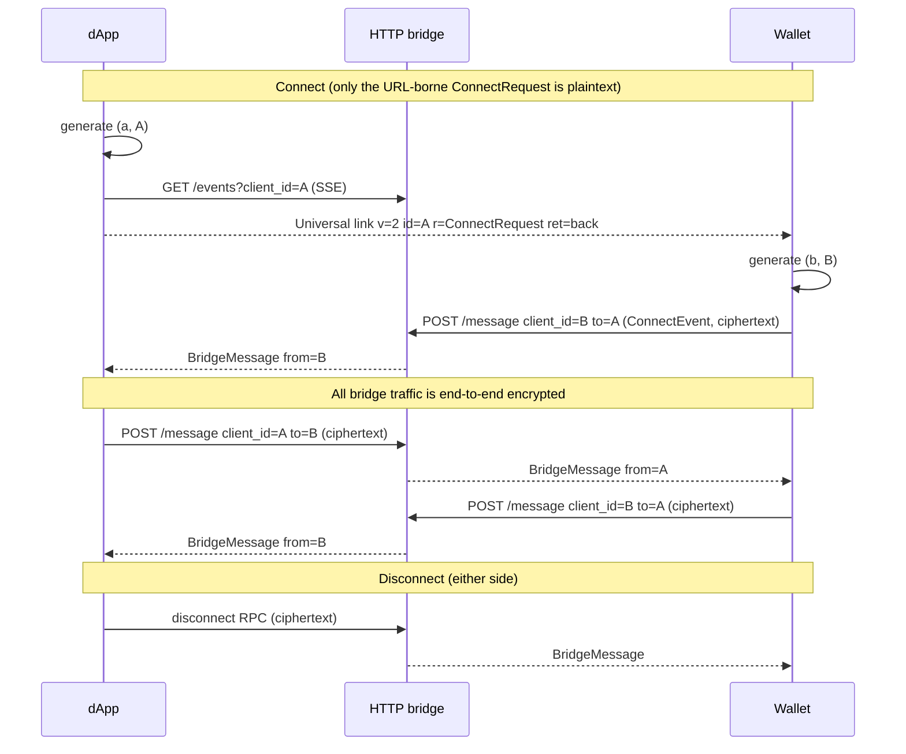
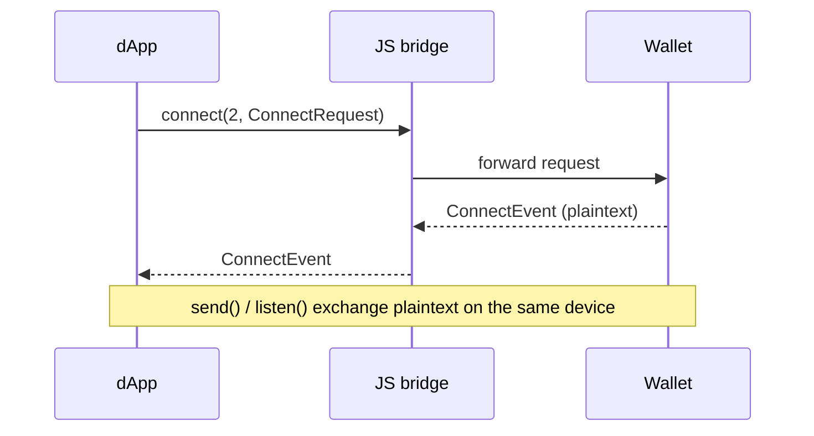

import { Image } from '/snippets/image.jsx';

{/* TODO(spec-merge): spec links point to `the-ton-tech/ton-connect` (`feature/refine-protocol`); switch to `ton-blockchain/ton-connect` once merged. */}

TON Connect is a protocol that links dApps to wallets. This page introduces the main building blocks — architecture, bridges, sessions, links, manifests, the wallet registry, feature negotiation, and the security model. Each section gives you enough context to work with the SDK; the full protocol details live in the [protocol specification](https://github.com/the-ton-tech/ton-connect/blob/feature/refine-protocol/spec/overview.md).

---

## Architecture

TON Connect has three roles: the **app**, the **wallet**, and the **bridge**.

- The **app** runs in the user's browser, native app, or inside the wallet's webview.
- The **wallet** holds the user's keys and signs on the user's behalf.
- The **bridge** relays encrypted messages between the two. It is operated by the wallet provider and is not trusted with plaintext.

Two transports carry the protocol:

- The **HTTP bridge** — used when the app and the wallet are on different devices or in different browsers. Messages are end-to-end encrypted; the bridge sees only ciphertext.
- The **JS bridge** — used when the app runs inside the wallet's webview, or the wallet is a browser extension. Both sides share the device, so messages are exchanged in plaintext.

<Image
  src="/resources/images/ton-connect/basic-schema.svg"
  darkSrc="/resources/images/ton-connect/basic-schema-dark.svg"
  alt="Basic communication schema of TON Connect"
/>

### Connect, request, disconnect over the HTTP bridge



Only the `ConnectRequest` embedded in the universal link travels in clear; once the wallet generates its keypair `(b, B)`, every bridge message — starting with the wallet's `ConnectEvent` reply — is encrypted with `nacl.box` under the session keys.

### Connect over the JS bridge



For wire-level details, see the [protocol specification overview](https://github.com/the-ton-tech/ton-connect/blob/feature/refine-protocol/spec/overview.md), the [Bridge specification](https://github.com/the-ton-tech/ton-connect/blob/feature/refine-protocol/spec/bridge.md), the [Session specification](https://github.com/the-ton-tech/ton-connect/blob/feature/refine-protocol/spec/session.md), and the [Connect specification](https://github.com/the-ton-tech/ton-connect/blob/feature/refine-protocol/spec/connect.md).

---

## Bridges

A bridge is the transport that carries TON Connect messages between an app and a wallet. The protocol defines two types.

| Type        | When it is used                                                            | Encryption               |
| ----------- | -------------------------------------------------------------------------- | ------------------------ |
| HTTP bridge | App and wallet on different devices or in different browsers               | End-to-end (NaCl)        |
| JS bridge   | App runs inside the wallet's webview, or the wallet is a browser extension | Not needed (same device) |

Both bridges deliver the same protocol messages — `ConnectRequest`, `ConnectEvent`, `AppRequest`, `WalletResponse`, `WalletEvent`. The transport is invisible to most dApp code thanks to the SDK.

The **HTTP bridge** is operated by the wallet provider and published in the wallet's [`wallets-list`](https://github.com/ton-connect/wallets-list) entry. It exposes two endpoints — `GET /events` (SSE stream) and `POST /message` — and buffers messages until the recipient picks them up or the TTL expires. Because the bridge is untrusted, every message after the initial connect is encrypted with NaCl `crypto_box`.

The **JS bridge** is injected by the wallet as `window.<key>.tonconnect` when the dApp runs inside the wallet's webview or as a browser extension. The `<key>` comes from the wallet's `bridge[]` entry of `type: "js"` in the wallets-list. The JS bridge does not use the session encryption keys — the webview and the wallet share a device, so the channel is already trusted and the SDK works directly with plaintext.

The SDK picks the JS bridge when available, otherwise falls back to the HTTP bridge. A wallet may list both.

Bridge endpoints and the `BridgeMessage` envelope accept an optional `trace_id` (UUID, UUIDv7 recommended) for analytics correlation. Tracing-aware bridges echo it back to the recipient, so the dApp, bridge, and wallet share one ID per user-visible operation. The SDK auto-generates a `traceId` per call and exposes it on every response — use it as the correlation key in your own logs.

Spec reference: [Bridge specification](https://github.com/the-ton-tech/ton-connect/blob/feature/refine-protocol/spec/bridge.md).

---

## Sessions and keypairs

A TON Connect session is the agreement between one app and one wallet account. Each side generates an X25519 keypair on first contact (NaCl `crypto_box`). The 32-byte public key becomes that side's `client_id`. The session is the pair of those two `client_id`s: the dApp's `A` and the wallet's `B`.

Session keys do two jobs:

- **Routing.** The HTTP bridge keeps a per-`client_id` queue. Each side subscribes to its own queue and posts to the other side's.
- **Encryption.** Every message after the initial connect is encrypted with `nacl.box`. Each message carries a fresh 24-byte random nonce. The bridge sees only ciphertext, the sender's `client_id`, and the TTL.

The JS bridge does not use these keys — see [Bridges](#bridges).

### What is persisted

| Persisted (dApp side)                                                    | Not persisted       |
| ------------------------------------------------------------------------ | ------------------- |
| Session keypair (`a`, `A`)                                               | RPC request bodies  |
| Wallet's `client_id` (`B`)                                               | RPC response bodies |
| Wallet's bridge URL                                                      | Encryption nonces   |
| `DeviceInfo` from the connect event                                      | Connect modal state |
| Wallet account info (`address`, `chain`, `walletStateInit`, `publicKey`) |                     |
| Last SSE event ID (`lastWalletEventId`) for resumable reconnects         |                     |
| Next outgoing RPC request ID (`nextRpcRequestId`)                        |                     |

The wallet keeps the corresponding state on its side: its keypair `(b, B)`, the dApp's `client_id` `A`, the manifest URL it approved, and any per-session UI state. Browser SDKs default to `localStorage`; headless or server-side flows pass an `IStorage` implementation.

Treat the stored values like session secrets. The `client_id` is semi-private — anyone who knows it can fetch ciphertext or remove queued bridge messages.

### Lifetime

The dApp persists its keypair, the wallet's `client_id`, the bridge URL, and the last SSE event ID. On reload the SDK calls `restoreConnection()`:

- **Restored.** Both sides reconnect to their bridge queues and the SDK continues. The wallet sees no new connect prompt.
- **Revoked.** The wallet has dropped the session. The SDK returns `UNKNOWN_APP_ERROR` (code `100`) and clears local state.
- **Bridge unreachable.** The SDK retries with backoff; the connection stays in a "restoring" state until the bridge responds.

A session is not bound to a single browser tab — reloads and cross-tab sharing work as long as storage persists.

### Multi-device behaviour

A session is bound to wherever its keypair lives. The protocol does not synchronise keypairs across devices.

- **Tabs in the same browser.** Same origin, same `localStorage`, one shared session.
- **Different browsers, profiles, or devices.** Distinct storage means a distinct keypair. The user goes through the connect flow on each, producing separate sessions.
- **Custom storage backends.** A headless app injects an `IStorage` (IndexedDB, encrypted file, server database). One keypair per logical session — keyed per user on a multi-tenant server, not shared globally.
- **Do not copy session state to another device.** Anyone holding the dApp's secret key `a` and `client_id` `B` can decrypt every message in the session. To "share" a connection across devices, do a fresh connect on each.

For cross-device continuity, use `ton_proof` with a server-issued token — the user reconnects on each device, the backend verifies the proof, and the token follows the user. See [Authenticate with `ton_proof`](/ecosystem/ton-connect/how-to/connect#authenticate-with-ton_proof).

Spec reference: [Session specification](https://github.com/the-ton-tech/ton-connect/blob/feature/refine-protocol/spec/session.md). See also [Disconnect a session](/ecosystem/ton-connect/how-to/disconnect).

---

## Universal links

A TON Connect connection starts with a deep link from the dApp to the wallet — as a tap on mobile, a QR code on desktop, or a click inside a webview. The link comes in three forms.

**Wallet universal link** — an HTTPS link specific to one wallet, listed as `universal_url` in [`wallets-list`](https://github.com/ton-connect/wallets-list). Used when the user has picked a wallet from the picker.

```
https://<wallet-universal-url>?v=2&id=<client_id>&r=<ConnectRequest>&ret=back
```

**Unified `tc://`** — the protocol-level scheme every wallet supports. A single QR code connects to any installed TON Connect wallet.

```
tc://?v=2&id=<client_id>&r=<ConnectRequest>&ret=back
```

**Custom-scheme deep link** — a wallet-specific scheme like `tonkeeper-tc://`, published as `deepLink` in the wallets-list.

### Parameters

| Param      | Required | Meaning                                                                                                                                                                                                              |
| ---------- | -------- | -------------------------------------------------------------------------------------------------------------------------------------------------------------------------------------------------------------------- |
| `v`        | yes      | Protocol version (`2`).                                                                                                                                                                                              |
| `id`       | yes      | dApp's `client_id` as hex (no `0x` prefix).                                                                                                                                                                          |
| `r`        | yes      | URL-safe JSON of `ConnectRequest`.                                                                                                                                                                                   |
| `ret`      | no       | Return strategy: `back` (default), `none`, or a URL.                                                                                                                                                                 |
| `e`        | no       | Embedded RPC request, base64-URL JSON. Requires `EmbeddedRequest` feature.                                                                                                                                           |
| `trace_id` | no       | UUID (UUIDv7 recommended) for end-to-end analytics correlation across dApp, bridge, and wallet. Echoed by tracing-aware bridges in the `BridgeMessage` envelope, and reused by tracing-aware wallets on their reply. |

The `e` parameter packs an RPC request into the connect URL so the wallet handles connection and action in a single tap. Wallets that support this advertise `EmbeddedRequest` in their feature list; wallets that do not silently ignore `e` and the SDK falls back to the two-step flow. See [Connect-and-act in one tap](/ecosystem/ton-connect/how-to/embedded-request).

Spec reference: [Deep links specification](https://github.com/the-ton-tech/ton-connect/blob/feature/refine-protocol/spec/deeplinks.md).

---

## Manifest

The app manifest is a JSON file the wallet fetches before showing the connect prompt. It carries metadata the wallet displays to the user — app name, icon, and optional legal links.

The dApp passes the URL as `manifestUrl` in the connect request. By convention the file is named `tonconnect-manifest.json` and hosted at the root of the dApp's domain.

### Fields

| Field              | Required | Description                                                          |
| ------------------ | -------- | -------------------------------------------------------------------- |
| `url`              | yes      | App URL. Used as the dApp identifier. No trailing slash.             |
| `name`             | yes      | Display name shown to the user.                                      |
| `iconUrl`          | yes      | App icon URL. PNG or ICO, 180×180 px recommended. SVG not supported. |
| `termsOfUseUrl`    | no       | URL to terms of use.                                                 |
| `privacyPolicyUrl` | no       | URL to privacy policy.                                               |

The manifest must be reachable with a `GET` from any origin, without CORS restrictions, without auth and without a proxy challenge. It must be served over HTTPS — wallets do not guarantee they will fetch a manifest served over plain HTTP. If the wallet cannot fetch it, the connect flow returns `MANIFEST_NOT_FOUND_ERROR` (code 2) or `MANIFEST_CONTENT_ERROR` (code 3). See [Manifest 404 and CORS](/ecosystem/ton-connect/troubleshooting#manifest-404-and-cors).

Spec reference: [App manifest specification](https://github.com/the-ton-tech/ton-connect/blob/feature/refine-protocol/spec/manifest.md). Schema: [Manifest JSON schema](https://github.com/the-ton-tech/ton-connect/blob/feature/refine-protocol/spec/schemas/manifest.schema.json).

---

## Wallets list registry

The wallets list is a public JSON registry of TON Connect-compatible wallets. Its source repository is [`ton-connect/wallets-list`](https://github.com/ton-connect/wallets-list). Every entry tells the SDK how to open and communicate with a wallet — bridge transports, universal link, supported platforms, advertised features, and the injected JS bridge key when available.

The SDK fetches [`wallets-v2.json`](https://config.ton.org/wallets-v2.json) at runtime and falls back to a bundled copy if the fetch fails.

### Entry shape

Each entry carries identity and branding (`app_name`, `name`, `image`, `about_url`), one or two bridge transports (`sse` URL and/or `js` key), link forms (`universal_url`, `deepLink`), the `platforms` it runs on, and `features` it supports.

For example, the Tonkeeper entry:

```json
{
  "app_name": "tonkeeper",
  "name": "Tonkeeper",
  "image": "https://tonkeeper.com/assets/tonconnect-icon.png",
  "tondns": "tonkeeper.ton",
  "about_url": "https://tonkeeper.com",
  "universal_url": "https://app.tonkeeper.com/ton-connect",
  "deepLink": "tonkeeper-tc://",
  "bridge": [
    { "type": "sse", "url": "https://bridge.tonapi.io/bridge" },
    { "type": "js", "key": "tonkeeper" }
  ],
  "platforms": ["ios", "android", "chrome", "firefox", "macos", "windows", "linux"],
  "features": [
    { "name": "SendTransaction", "maxMessages": 255, "extraCurrencySupported": true },
    { "name": "SignData", "types": ["text", "binary", "cell"] }
  ]
}
```

### How dApps consume it

The SDK loads `wallets-v2.json` and prepares the list before rendering the modal:

1. **Platform handling.** The UI uses `platforms` as a display and connection hint. Mobile views show `ios`/`android` wallets; desktop views can still show mobile wallets because QR-code connection is a desktop flow.
1. **Feature handling.** When the dApp declares required capabilities via [`walletsRequiredFeatures`](/ecosystem/ton-connect/how-to/filter-wallets), the UI checks each entry's `features` array. Once a session opens, the SDK checks the runtime `DeviceInfo.features`, which is authoritative.
1. **Injected detection.** For entries that list a `js` bridge, the SDK probes `window[<bridge.key>]`. If present, that wallet is marked as injected.

### How a wallet gets listed

1. Implement TON Connect — at minimum the connect handshake and `sendTransaction`. See the [wallet developer guide](https://github.com/the-ton-tech/ton-connect/blob/feature/refine-protocol/spec/guides/wallet-guidelines.md).
1. Deploy an HTTP bridge according to the [bridge spec](https://github.com/the-ton-tech/ton-connect/blob/feature/refine-protocol/spec/bridge.md), expose a JS bridge, or both.
1. Open a pull request against [`ton-connect/wallets-list`](https://github.com/ton-connect/wallets-list) with your entry appended to `wallets-v2.json`.
1. CI validates the entry against the [wallets list JSON schema](https://github.com/ton-connect/wallets-list/blob/main/wallets-v2.schema.json).

dApps may also add wallets directly through the SDK, bypassing the registry — useful for staging or partner integrations.

Spec reference: [Wallets list specification](https://github.com/the-ton-tech/ton-connect/blob/feature/refine-protocol/spec/wallets-list.md). Schema: [Wallets list JSON schema](https://github.com/the-ton-tech/ton-connect/blob/feature/refine-protocol/spec/schemas/wallets-v2.schema.json).

---

## Features and protocol negotiation

TON Connect uses explicit feature flags. When a wallet sends a `ConnectEvent`, it includes a `features` array inside `DeviceInfo`. The dApp reads it to decide which RPC methods are safe to call.

### Feature entries

| Feature           | Meaning                                                                                                          |
| ----------------- | ---------------------------------------------------------------------------------------------------------------- |
| `SendTransaction` | The wallet accepts `sendTransaction`. Includes `maxMessages` and optional `itemTypes`, `extraCurrencySupported`. |
| `SignData`        | The wallet accepts `signData` for the listed payload `types` (`text`, `binary`, `cell`).                         |
| `SignMessage`     | The wallet accepts `signMessage` (sign without broadcast). Same shape as `SendTransaction`.                      |
| `EmbeddedRequest` | The wallet processes the `e` URL parameter for one-tap connect-and-act.                                          |

The `features` in the registry are static (what the binary supports). The runtime `DeviceInfo.features` from the connect event is authoritative — the SDK refuses methods not in the runtime list, even if the registry entry claims support.

---

## Security model

**The bridge is untrusted.** Every message after the initial connect is end-to-end encrypted. The bridge sees only ciphertext, `client_id`s, and TTL. A malicious bridge can drop messages or measure timing, but cannot decrypt or impersonate either side.

**The dApp's domain is bound to the connection.** The wallet displays the manifest's domain at connect time. `ton_proof` signatures bind the domain so one dApp cannot replay another's proof.

**Replay protection** is layered: per-message nonces, monotonic request and event `id`s, and `valid_until` timestamps. For login, `ton_proof` adds a server-issued nonce with an expiry.

**What the protocol does not protect against:** a compromised wallet device, phishing manifests on typo-domains, or smart contract bugs. The wallet signs the bytes the dApp provides — on-chain logic is out of scope.

Spec reference: [Session specification](https://github.com/the-ton-tech/ton-connect/blob/feature/refine-protocol/spec/session.md), [`ton_proof` signature specification](https://github.com/the-ton-tech/ton-connect/blob/feature/refine-protocol/spec/connect.md#address-proof-signature-ton_proof), and the [Bridge specification](https://github.com/the-ton-tech/ton-connect/blob/feature/refine-protocol/spec/bridge.md).
