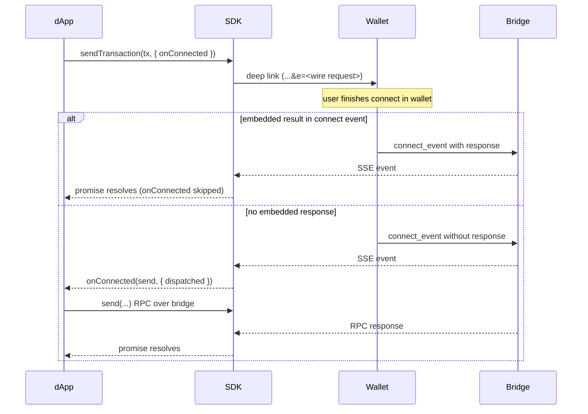

{/* TODO(spec-merge): spec links point to `the-ton-tech/ton-connect` (`feature/refine-protocol`); switch to `ton-blockchain/ton-connect` once merged. */}

An _embedded request_ packs an action — `sendTransaction`, `signMessage`, or `signData` — into the wallet's connect URL via the `e` query parameter. The wallet handles connection and the action in a single tap, eliminating the connect → act round-trip.

This optimisation applies to mobile deep links and universal links. Desktop QR scans and the in-wallet JS bridge fall back to the standard two-step flow automatically.

## How it works

1. The dApp calls `sendTransaction`, `signMessage`, or `signData` with an `onConnected` option.
2. The SDK opens the wallet selection modal.
3. When the user picks a wallet that advertises the `EmbeddedRequest` feature, the SDK encodes the request as the `e` parameter on that wallet's universal link.
4. The user taps the link. The wallet opens with both the connect request and the embedded action.
5. The wallet presents both to the user — one combined screen, two sequential screens, or any UX of its choice.
6. If the wallet returns the action result inside the `connect` event (`response` on the connect payload), the original `sendTransaction` / `signMessage` / `signData` promise resolves with that result and `onConnected` is not called.

If there is no embedded result in the connect event — the wallet ignored `e`, the bridge race lost, or the SDK never attached `e` — the session is connected but the action still needs a normal RPC round-trip. The SDK then calls `onConnected(send, { dispatched })`. The outer promise resolves only when `onConnected` finishes; the dApp decides when (or whether) to call `send()`, which performs that second dispatch over the bridge.

`dispatched` tells the handler whether the SDK actually packed the action into the connect URL. The right behaviour differs between the two branches — branch on `dispatched` rather than always calling `send()`, otherwise the user may sign the same transaction twice.



## Recommended pattern

`onConnected` receives a `send` function (re-issues the request over the bridge with optional per-dispatch overrides) and a context with `dispatched: boolean`. The shape of the handler depends on which branch fires:

- **`dispatched === false`** — the SDK could not pack the action into the connect URL (the wallet does not advertise `EmbeddedRequest`, the encoded URL would have been too long, or another condition skipped the embedding). The wallet has not seen the action. Just call `send()` — the SDK runs the standard request-and-redirect flow with the live user activation. No extra UI needed.
- **`dispatched === true`** — the SDK packed the action and the wallet was supposed to process it, but the connect event came back without an embedded response. The wallet may have already executed the request, ignored it, or rejected it — the connect event does not say. Calling `send()` unconditionally risks signing the action a **second time**. Ask the user to confirm and verify on-chain before re-sending.

A unified handler that gets the right UX in both branches:

```tsx
const result = await tonConnectUi.sendTransaction(tx, {
    onConnected: async (send, { dispatched }) => {
        if (!dispatched) return send();

        // The wallet may have already handled the request. Verify on-chain first,
        // and fall back to a user confirmation if the action did not land yet.
        const onchain = await findOnchainTransaction(tx);
        if (onchain) return { boc: onchain.boc };

        const confirmed = await openConfirmDialog({
            title: 'Send again?',
            body: 'The wallet may have already received this request. Continue to send another one?',
        });
        if (!confirmed) throw new Error('user cancelled');

        return send({
            onRequestSent: redirectToWallet =>
                setOpenWallet(() => redirectToWallet),
        });
    },
});
```

`findOnchainTransaction` and `openConfirmDialog` are the dApp's own helpers — a TonAPI / indexer lookup and a promise-based modal. Returning `{ boc }` from `onConnected` resolves the outer promise with that value and skips the second bridge dispatch entirely.

`setOpenWallet` stores `redirectToWallet` so a separate **Open wallet** button can run it inside a fresh user gesture; see [Corner case: bridge waits over five seconds](#corner-case-bridge-waits-over-five-seconds) for why this matters.

> **Warning.** `dispatched: true` is not a success signal — it only says the SDK packed `e` into the connect URL. Whether the wallet executed, ignored, or rejected the request is unknown until you check the chain or prompt the user. Calling `send()` without that check submits the action a second time.

The same handler shape applies to `sendTransaction`, `signMessage`, and `signData`. For relay-style gasless flows with `signMessage`, see [Sign and relay a message (gasless)](/ecosystem/ton-connect/how-to/sign-message-gasless).

The action call accepts an optional `traceId` (UUIDv7 by default). The SDK propagates the same ID through the connect URL's `trace_id` parameter, the embedded request, and any follow-up `send()` over the bridge — so the dApp, wallet, and bridge share one correlation key whether the action lands in the embedded response or in the fallback RPC. Read it back from the resolved result (`result.traceId`) and log it next to your analytics events.

## React example

```tsx
import { useState } from 'react';
import { useTonConnectUI, SendTransactionRequest } from '@tonconnect/ui-react';

const tx: SendTransactionRequest = {
    validUntil: Math.floor(Date.now() / 1000) + 600,
    network: '-239',
    items: [
        {
            type: 'ton',
            address: 'Ef8AAAAAAAAAAAAAAAAAAAAAAAAAAAAAAAAAAAAAAAAAADAU',
            amount: '5000000',
        },
    ],
};

function PayButton() {
    const [tonConnectUi] = useTonConnectUI();
    const [loading, setLoading] = useState(false);
    const [openWallet, setOpenWallet] = useState<(() => void) | null>(null);
    const [pendingConfirm, setPendingConfirm] = useState<
        { resolve: (ok: boolean) => void } | null
    >(null);

    const handlePay = async () => {
        setOpenWallet(null);
        setLoading(true);
        try {
            const result = await tonConnectUi.sendTransaction(tx, {
                onConnected: async (send, { dispatched }) => {
                    if (!dispatched) return send();

                    const onchain = await findOnchainTransaction(tx);
                    if (onchain) return { boc: onchain.boc };

                    const confirmed = await new Promise<boolean>(resolve =>
                        setPendingConfirm({ resolve }),
                    );
                    if (!confirmed) throw new Error('user cancelled');

                    return send({
                        onRequestSent: redirectToWallet =>
                            setOpenWallet(() => redirectToWallet),
                    });
                },
            });
            console.log('Transaction sent:', result.boc);
        } catch (e) {
            console.error('Transaction failed:', e);
        } finally {
            setLoading(false);
            setPendingConfirm(null);
        }
    };

    return (
        <>
            <button type="button" onClick={handlePay} disabled={loading}>
                {loading ? 'Processing…' : 'Pay 0.005 TON'}
            </button>

            {pendingConfirm && (
                <ConfirmDialog
                    title="Send again?"
                    body="The wallet may have already received this request."
                    onConfirm={() => pendingConfirm.resolve(true)}
                    onCancel={() => pendingConfirm.resolve(false)}
                />
            )}

            {openWallet && (
                <button type="button" onClick={openWallet}>
                    Open wallet
                </button>
            )}
        </>
    );
}
```

`ConfirmDialog` is the dApp's own component; the example uses a state-promise to turn it into an `await`-able prompt. The **Open wallet** button only appears in the dispatched-and-confirmed branch, after the bridge accepts the second RPC.

## When the SDK embeds vs falls back

The SDK embeds the request only when all four conditions hold:

1. The wallet is not yet connected.
1. `onConnected` is provided in the request options.
1. The user picks a wallet whose `DeviceInfo.features` lists `EmbeddedRequest`.
1. The encoded URL fits within the SDK's URL length budget (currently 1024 characters).

If any condition fails, the SDK opens the wallet without `e` and either calls `onConnected` with `dispatched: false` or, when `onConnected` is omitted, throws.

| Scenario                                               | Behaviour                                                                                                                          |
| ------------------------------------------------------ | ---------------------------------------------------------------------------------------------------------------------------------- |
| Embedded result delivered in the `connect` event       | Promise resolves from that payload; `onConnected` not used                                                                         |
| Selected wallet does not advertise `EmbeddedRequest`   | `e` is omitted; `onConnected` called with `dispatched: false`                                                                      |
| Encoded URL exceeds the length budget                  | `e` is dropped; `onConnected` called with `dispatched: false`                                                                      |
| Wallet receives `e` but returns no embedded response   | `onConnected` called with `dispatched: true` — verify on-chain, otherwise prompt the user before re-sending to avoid a double-send |
| `onConnected` omitted while the wallet is disconnected | SDK throws `TonConnectUIError`                                                                                                     |

## When not to use embedded requests

- Long-running flows where the user must review state between connect and action.
- Flows where the outbound payload must be built from data you only obtain after connecting (custom routing, proofs, contract reads). Ordinary TON, jetton, and NFT transfers are not in that bucket — use [structured `items`](/ecosystem/ton-connect/how-to/send-transaction#structured-items) (`ton`, `jetton`, `nft`) so the wallet builds the cells and the encoded link stays smaller than hand-rolled `messages`.

## See also

- [Send a transaction](/ecosystem/ton-connect/how-to/send-transaction)
- [Sign and relay a message (gasless)](/ecosystem/ton-connect/how-to/sign-message-gasless)
- [Filter wallets by required features](/ecosystem/ton-connect/how-to/filter-wallets) — declare `EmbeddedRequest` as required
- [Embedded requests implementer guide](https://github.com/the-ton-tech/ton-connect/blob/feature/refine-protocol/spec/guides/embedded-requests.md)
- [Bridge specification](https://github.com/the-ton-tech/ton-connect/blob/feature/refine-protocol/spec/bridge.md) — embedded requests
