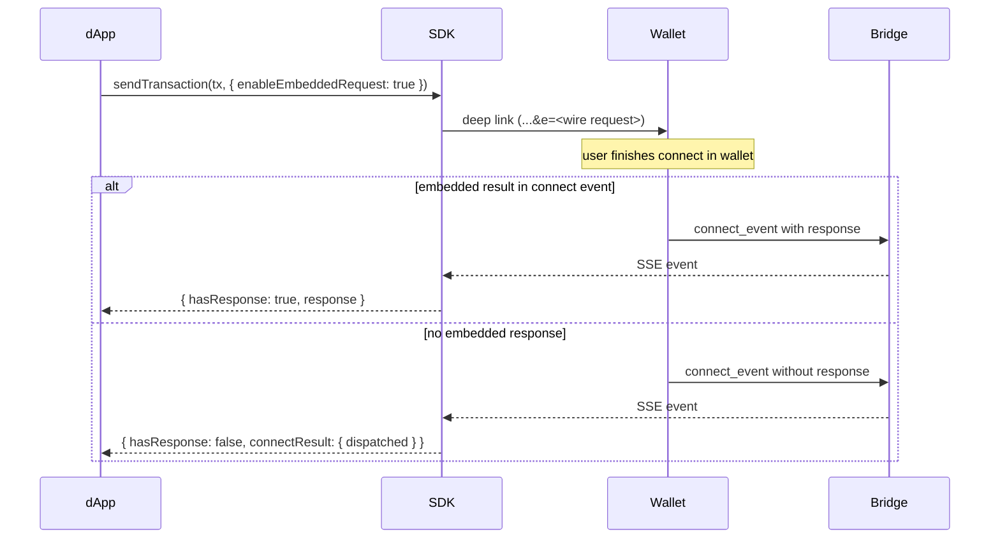

## Overview

An _embedded request_ packs an action — `sendTransaction`, `signMessage` or `signData` — into the wallet's connect URL via the `e` query parameter. A compatible wallet bundles the connect approval and the action into one screen and returns the signed result with the connect response, saving the second round-trip.

This optimisation applies to mobile deep links and universal links. Desktop QR scans and the in-wallet JS bridge fall back to the standard two-step flow automatically.

## How it works

1. The dApp calls `sendTransaction`, `signMessage` or `signData` with `enableEmbeddedRequest: true`.
2. The SDK opens the wallet selection modal.
3. If the user picks a wallet that advertises the `EmbeddedRequest` feature, the SDK encodes the request as `e=base64url(JSON.stringify(WireEmbeddedRequest))` on that wallet's universal link.
4. The user taps the link. The wallet opens with both the connect request and the embedded action.
5. The wallet returns the signed result inside the connect event. The SDK resolves the action promise with `{ hasResponse: true, response }`.

If no embedded result comes back — the wallet ignored `e`, the SDK never attached it or the wallet returned only the connect event — the session is connected but the action did not land. The SDK resolves with `{ hasResponse: false, connectResult: { dispatched } }` so the dApp can decide what to do next.



## The response shape

With the flag on, every signing method returns a discriminated envelope instead of the raw response. Branch on `hasResponse`:

```ts
type EmbeddedTResponse<TResponse> =
    | { hasResponse: true;  response: TResponse }
    | { hasResponse: false; connectResult: { dispatched: boolean } };
```

The envelope is the same shape regardless of whether the wallet was already connected when you called the method. When the wallet is connected, the SDK runs the normal bridge flow and wraps the result in `{ hasResponse: true, response }` — so the dApp keeps one linear code path.

### Behaviour matrix

| Wallet state at call time      | `enableEmbeddedRequest` | Behaviour                                                                                            | Return                                                          |
| ------------------------------ | ----------------------- | ---------------------------------------------------------------------------------------------------- | --------------------------------------------------------------- |
| Connected                      | not set                 | Bridge flow (existing behaviour).                                                                    | `SendTransactionResponse` / `SignDataResponse` / `SignMessageResponse` |
| Connected                      | `true`                  | Bridge flow, wrapped in the envelope.                                                                | `{ hasResponse: true, response }`                               |
| Not connected                  | not set                 | Throws `TonConnectUIError('Connect wallet to …')`.                                                   | —                                                               |
| Not connected, wallet folds it | `true`                  | Connect URL carries `e=…`; the wallet returns connect and signed result together.                    | `{ hasResponse: true, response }`                               |
| Not connected, no fold         | `true`                  | Wallet returns connect only; the request may or may not have been delivered.                         | `{ hasResponse: false, connectResult: { dispatched } }`         |

### Meaning of `dispatched`

- `dispatched: false` — the SDK did **not** put the request into the connect URL. The wallet never saw it.
- `dispatched: true` — the SDK **did** put the request into the connect URL, but the wallet's connect response carried no signed result. The wallet may have already shown the user the approval prompt and even submitted the transaction. The dApp does not know which. A blind retry can result in a double payment or a second signature for the same payload.

## Retry rules

> **Warning.** Do not retry inside the same async flow. When `dispatched: true`, the wallet may have already processed the request — verify on-chain or in your backend state before re-prompting.

A `hasResponse: false` result is a UI state, not an exception. The dApp must not retry inside the same async flow:

- Do not auto-retry inline. The user has no opportunity to veto.
- Do not drive the retry from `confirm()`. Users tap through repeated prompts.
- Set a piece of state, render a **Retry** button and let the user click it.
- When `dispatched: true`, show a warning explaining the duplicate risk. If the dApp has on-chain or backend lookup logic, run it before showing the retry button — or use it to skip the retry entirely when the action already landed.

The retry button calls the **same** handler as the original click. With the flag still on and the wallet now connected, the SDK takes the bridge path and wraps the result in `{ hasResponse: true, response }`. No special retry-only method exists.

## Enabling embedded requests

The pattern is the same for `sendTransaction`, `signData` and `signMessage`. Set `enableEmbeddedRequest: true` and branch on `hasResponse`:

```ts
const r = await tonConnectUi.sendTransaction(tx, { enableEmbeddedRequest: true });
if (!r.hasResponse) {
    // store r.connectResult.dispatched in app state, then render a Retry control
    return;
}
useResponse(r.response);
```

On the `hasResponse: false` branch, persist `dispatched` somewhere the UI can read it, then surface a **Retry** control:

- `dispatched: false` — the message says the wallet did not receive the request.
- `dispatched: true` — the message warns that the wallet may have already processed the request and tells the user to check on-chain history before retrying.

The retry control calls the same invocation with the flag still on. The wallet is connected by then, so the SDK takes the bridge path and returns `{ hasResponse: true, response }`.

## When the SDK embeds vs falls back

The SDK embeds the request only when all four conditions hold:

1. The wallet is not yet connected.
2. `enableEmbeddedRequest: true` is set on the call.
3. The user picks a wallet whose `DeviceInfo.features` lists `EmbeddedRequest`.
4. The encoded URL fits within the SDK's URL length budget.

If any condition fails, the SDK opens the wallet without `e` and either returns `{ hasResponse: false, connectResult: { dispatched: false } }` (when the flag is set) or throws `TonConnectUIError` (when it is not).

## Requiring embedded support

To hide wallets that do not advertise `EmbeddedRequest` from the modal, set `walletsRequiredFeatures.embeddedRequest` on the `TonConnectUI` instance. See [Filter wallets by required features](/applications/ton-connect/how-to/filter-wallets) for the full filter shape.

```ts
const tonConnectUi = new TonConnectUI({
    manifestUrl: 'https://example.com/tonconnect-manifest.json',
    walletsRequiredFeatures: { embeddedRequest: {} },
});
```

Without that filter, embedded is a soft capability — the SDK falls back to the bridge flow transparently.

## When not to use embedded requests

- Long-running flows where the user must review state between connect and action.
- Flows where the outbound payload depends on data the dApp only obtains after connecting (custom routing, proofs, contract reads). Ordinary TON, jetton and NFT transfers are not in that bucket — use [structured `items`](/applications/ton-connect/how-to/send-transaction#structured-items) (`ton`, `jetton`, `nft`) so the wallet builds the cells and the encoded link stays under the length budget.

## See also

- [Send a transaction](/applications/ton-connect/how-to/send-transaction)
- [Sign data](/applications/ton-connect/how-to/sign-data)
- [Sign and relay a message (gasless)](/applications/ton-connect/how-to/sign-message-gasless)
- [Filter wallets by required features](/applications/ton-connect/how-to/filter-wallets) — declare `EmbeddedRequest` as required
- [Embedded requests implementer guide](https://github.com/ton-blockchain/ton-connect/blob/main/guides/embedded-requests.md)
- [Bridge specification](https://github.com/ton-blockchain/ton-connect/blob/main/spec/bridge.md) — embedded requests
