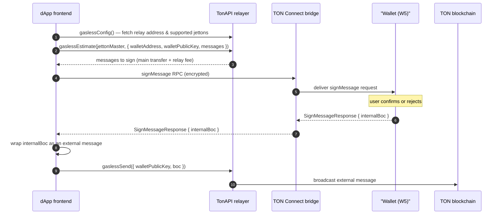

## Overview

`signMessage` asks the wallet to sign an internal message **without broadcasting it**. The dApp receives a signed BoC and submits it through a relayer — typically to pay gas in a jetton instead of TON. This flow is currently supported only for Wallet V5.

The request payload has the same shape as `sendTransaction`: it accepts both raw `messages` and structured [`items`](/applications/ton-connect/how-to/send-transaction#structured-items).

## Basic usage

```ts
import { useTonConnectUI } from '@tonconnect/ui-react';

const [tonConnectUi] = useTonConnectUI();

const result = await tonConnectUi.signMessage({
    validUntil: Math.floor(Date.now() / 1000) + 300,
    network: '-239', // mainnet; use '-3' for testnet
    messages: [
        {
            address: 'Ef8AAAAAAAAAAAAAAAAAAAAAAAAAAAAAAAAAAAAAAAAAADAU',
            amount: '5000000',   // in nanoTON (0.005 TON)
            payload: bodyBoc,    // optional, base64
            stateInit: initBoc,  // optional, base64
        }
    ]
});

const signedBoc = result.internalBoc; // base64-encoded signed internal message
const traceId = result.traceId;       // request correlation ID, useful for logs and analytics
```

The response shape:

```ts
type SignMessageResult = {
    internalBoc: string; // base64 signed internal message BoC
    traceId?: string;    // populated by the SDK to correlate the request across UI events and the bridge
};
```

## Gasless transactions via TonAPI relayer

The most common use is a gasless jetton transfer: the relayer takes its fee in the same jetton, so the user never holds TON.

The flow:

1. Resolve the user's jetton wallet address on-chain.
2. Build the jetton transfer cell to pass to the estimator.
3. Call `gaslessEstimate` — the relayer returns the exact messages to sign (main transfer plus the relay fee).
4. Call `signMessage` with those messages — the wallet signs but does not broadcast.
5. Wrap the signed BoC in an external message and submit via `gaslessSend`.



REST endpoints are documented in the [TonAPI gasless reference](https://docs.tonconsole.com/tonapi/rest-api/gasless). A parallel [TonAPI cookbook recipe](https://docs.tonconsole.com/tonapi/cookbook/gasless-transfer) shows the same flow.

```ts
import {
    Address,
    beginCell,
    Cell,
    external,
    internal,
    loadMessageRelaxed,
    storeMessage,
    storeMessageRelaxed,
    toNano
} from '@ton/core';
import { TonApiClient } from '@ton-api/client';
import { TonConnectUI } from '@tonconnect/ui';

const ta = new TonApiClient({ baseUrl: 'https://tonapi.io' });

const JETTON_TRANSFER_OP = 0x0f8a7ea5;
const BASE_JETTON_SEND_AMOUNT = toNano('0.05'); // attached TON for the jetton transfer message; pass as string to avoid float rounding

export async function sendGaslessJettonTransfer(
    tonConnectUi: TonConnectUI,
    jettonMaster: Address,
    destination: Address,
    jettonAmount: bigint,
): Promise<void> {
    if (!tonConnectUi.wallet?.account?.address || !tonConnectUi.wallet?.account?.publicKey) {
        throw new Error('No wallet connected.');
    }
    const walletAddress = Address.parse(tonConnectUi.wallet.account.address);
    const walletPublicKey = tonConnectUi.wallet.account.publicKey;

    // 1. Resolve the user's jetton wallet address.
    const result = await ta.blockchain.execGetMethodForBlockchainAccount(
        jettonMaster,
        'get_wallet_address',
        { args: [walletAddress.toRawString()] }
    );
    const jettonWallet = Address.parse(result.decoded.jettonWalletAddress);

    // 2. Build the jetton transfer cell.
    const { relayAddress } = await ta.gasless.gaslessConfig();

    const transferBody = beginCell()
        .storeUint(JETTON_TRANSFER_OP, 32)
        .storeUint(0, 64)           // query_id
        .storeCoins(jettonAmount)
        .storeAddress(destination)
        .storeAddress(relayAddress) // response_destination — excess goes to relayer
        .storeBit(false)            // no custom payload
        .storeCoins(1n)             // forward_amount
        .storeMaybeRef(undefined)   // no forward payload
        .endCell();

    const messageToEstimate = beginCell()
        .storeWritable(storeMessageRelaxed(internal({
            to: jettonWallet,
            bounce: true,
            value: BASE_JETTON_SEND_AMOUNT,
            body: transferBody,
        })))
        .endCell();

    // 3. Estimate the relay fee — returns the exact list of messages to sign.
    const params = await ta.gasless.gaslessEstimate(jettonMaster, {
        walletAddress,
        walletPublicKey,
        messages: [{ boc: messageToEstimate }],
    });

    // 4. Sign without broadcasting using the messages returned by the estimator.
    const { internalBoc } = await tonConnectUi.signMessage({
        validUntil: Math.floor(Date.now() / 1000) + 300,
        messages: params.messages.map(msg => ({
            address: msg.address.toString(),
            amount: msg.amount,
            payload: msg.payload?.toBoc()?.toString('base64'),
            stateInit: msg.stateInit?.toBoc()?.toString('base64'),
        })),
    });

    // 5. Wrap the signed internal message in an external message and submit via gaslessSend.
    const { info: { dest }, body, init } = loadMessageRelaxed(
        Cell.fromBase64(internalBoc).beginParse()
    );
    const extMessage = beginCell()
        .storeWritable(storeMessage(external({ to: dest as Address, init, body })))
        .endCell();

    // Retry the submission — the relayer can transiently reject while it observes the chain.
    await retry(
        () => ta.gasless.gaslessSend({ walletPublicKey, boc: extMessage }),
        { retries: 5, delayMs: 2000 },
    );
}

async function retry<T>(
    fn: () => Promise<T>,
    { retries, delayMs }: { retries: number; delayMs: number },
): Promise<T> {
    let lastError: unknown;
    for (let attempt = 0; attempt <= retries; attempt++) {
        try {
            return await fn();
        } catch (e) {
            lastError = e;
            if (attempt < retries) await new Promise(r => setTimeout(r, delayMs));
        }
    }
    throw lastError;
}
```

## Differences from `sendTransaction`

|                    | `sendTransaction`                | `signMessage`                               |
| ------------------ | -------------------------------- | ------------------------------------------- |
| Wallet broadcasts  | Yes                              | No                                          |
| Wallet deducts gas | Yes                              | No                                          |
| Result             | BoC of the broadcast transaction | `{ internalBoc }` — signed internal message |
| Use case           | Standard transfer                | Gasless / sponsored / custom relayer        |

## Preconditions and error handling

`signMessage` rejects synchronously in several cases before anything reaches the wallet:

- **No wallet connected.** `tonConnectUi.signMessage` throws `TonConnectUIError('Connect wallet to sign a message.')`. Either gate the call on `tonConnectUi.connected` (or `tonConnectUi.wallet`), or pass `options.enableEmbeddedRequest: true` to defer the request until a wallet is picked from the modal. When the payload uses structured [`items`](/applications/ton-connect/how-to/send-transaction#structured-items), the SDK can fold it into the connect URL as an [embedded request](/applications/ton-connect/how-to/embedded-request) so a compliant wallet handles connect and sign in one tap. The SDK's [`OneClickPay` demo](https://github.com/ton-connect/sdk/blob/main/apps/demo-dapp-with-react-ui/src/pages/OneClickPay/oneClickGaslessFlow.ts) shows the complete one-tap gasless flow end to end.
- **Wallet does not advertise the `SignMessage` feature.** The connector throws `TonConnectError` with `code: METHOD_NOT_SUPPORTED` before serializing the request.
- **Request validation fails** (missing fields, malformed payload, mismatched network). The connector throws `TonConnectError` with a validation message.

`TonConnectUIError` extends `TonConnectError`, so a single catch covers both:

```ts
import { TonConnectUI } from '@tonconnect/ui';
import { TonConnectError, TonConnectUIError } from '@tonconnect/ui';

try {
    const result = await tonConnectUi.signMessage(request);
} catch (e) {
    if (e instanceof TonConnectUIError) {
        // UI-layer preconditions, e.g. no wallet connected
        console.warn('Cannot sign message:', e.message);
    } else if (e instanceof TonConnectError) {
        // Validation, unsupported feature, user rejection, bridge error
        console.error('signMessage rejected:', e.message);
    }
}
```

To filter the wallet picker to only wallets that support `signMessage`, see [Filter wallets by required features](/applications/ton-connect/how-to/filter-wallets).

## Errors

| Code | Name                   | Description                |
| ---- | ---------------------- | -------------------------- |
| 0    | `UNKNOWN_ERROR`        | Unknown error.             |
| 1    | `BAD_REQUEST_ERROR`    | Bad request.               |
| 100  | `UNKNOWN_APP_ERROR`    | Unknown app.               |
| 300  | `USER_REJECTS_ERROR`   | User declined the request. |
| 400  | `METHOD_NOT_SUPPORTED` | Method not supported.      |

## See also

- [Send a transaction](/applications/ton-connect/how-to/send-transaction) — same payload shape, with broadcast
- [Filter wallets by required features](/applications/ton-connect/how-to/filter-wallets)
- [`signMessage` wallet guide](https://github.com/ton-blockchain/ton-connect/blob/main/guides/sign-message.md)
- [RPC specification](https://github.com/ton-blockchain/ton-connect/blob/main/spec/rpc.md)
